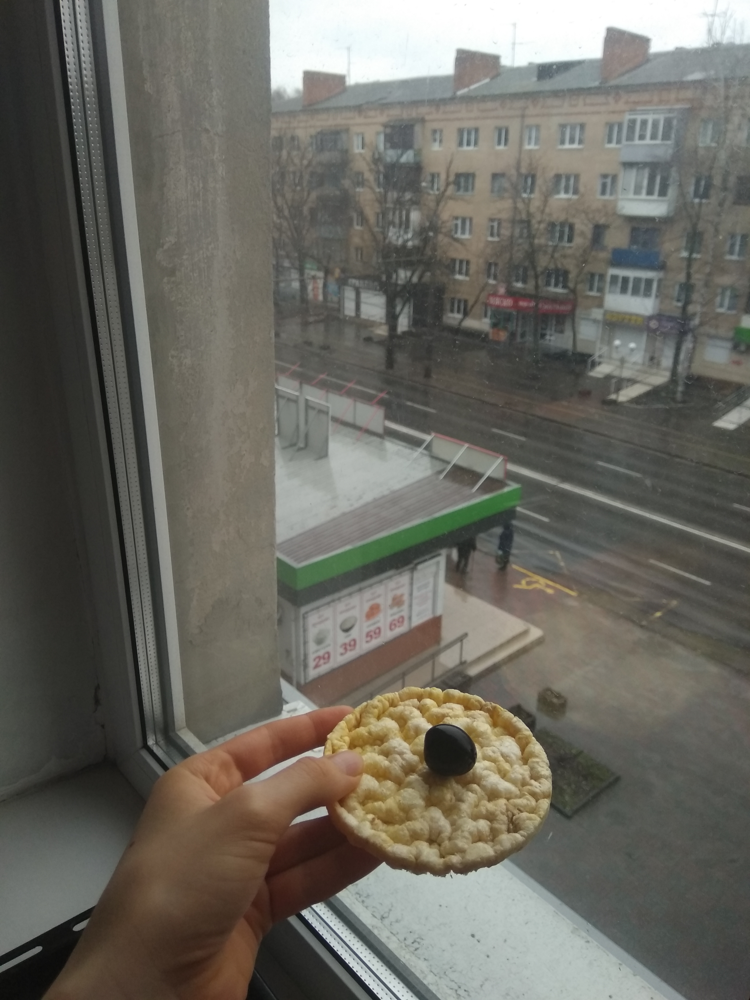
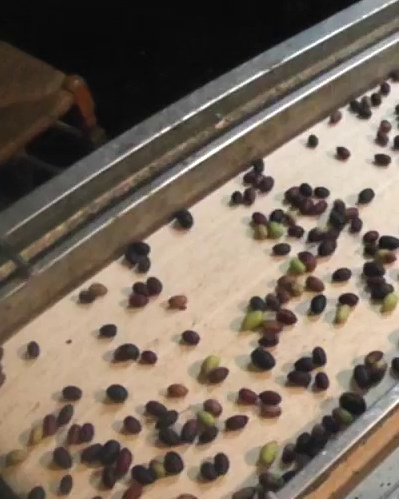
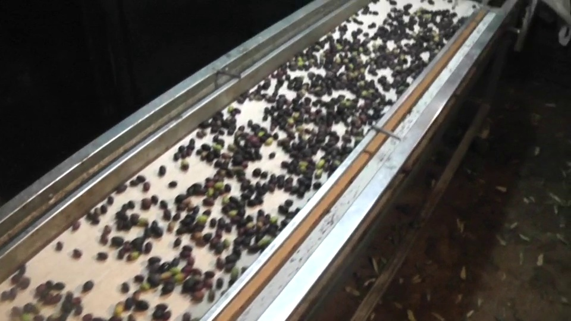
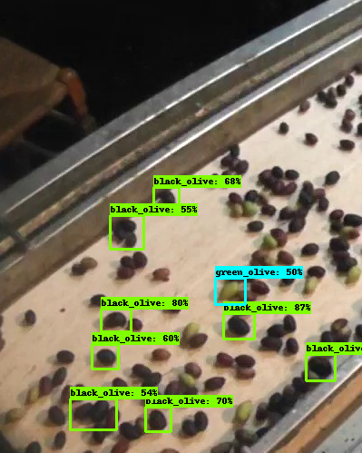
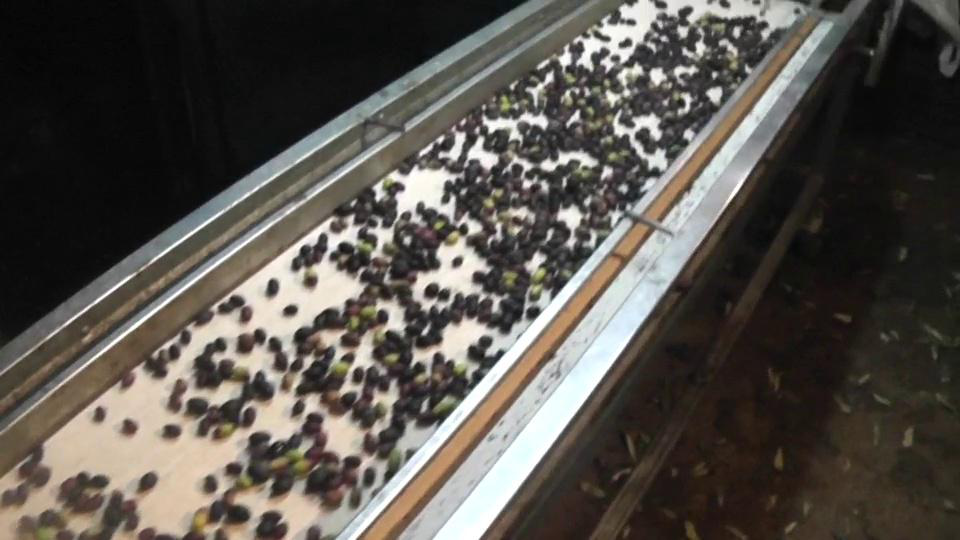

# Olive-Separation-With-TensorFlow-Object-Detection-API
The task is to identify and to count black and green olives in the video.

The steps:

### 1. Make 75 photos.
(25 black olives, 25 green olives, 25 both)

**Examples of images:**

### 2. Transform images into a size of 300x300.
Using *transform_image_resolution.py*

### 3. Create annotations in LableImg.
Creating CSV format from XML using *xml_to_csv.py*

### 4. Generate TFRecords.
Using *generate_tfrecord.py*

### 5. Create a label map file and a configuration file.
The used configuration file is https://github.com/tensorflow/models/blob/master/research/object_detection/configs/tf2/ssd_efficientdet_d0_512x512_coco17_tpu-8.config

### 6. Train model.
The used model is http://download.tensorflow.org/models/object_detection/tf2/20200711/efficientdet_d0_coco17_tpu-32.tar.gz

### 7. Export the inference graph.

### 8. Test the model.
**Input:**

**Output:**

`8 black olives.`

`1 green olives.`
